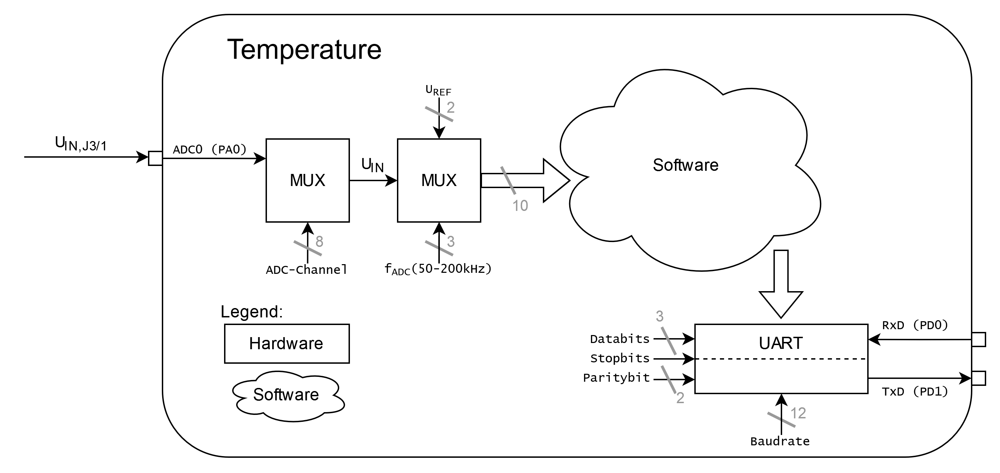

  

# `TMP` - Temperature Warning (Temperaturwarnung)

The `TMP` is a board with an [LM358](#additional-information) or any other 2-channel operational amplifier. The board itself is driven with a voltage of `5V`. It converts the temperature (0° - 100°) from an [KTY81/210](#additional-information) to a voltage. This voltage can be coupled onboard with a Schmitt-Trigger to change the status of the connected LEDs (`green`, `red`).

Optional the converted temperature can be digitalized through an A/D converter and sent to a terminal through UART. A demo how this can be done is attached and can be tested with an [ATmega16A](#additional-information).

| Experience | Level |
|:------------|:-----:|
| Soldering   |  |
| Software    |  |

# Downloads

| Type      | File               | Description              |
|:---------:|:------------------:|:-------------------------|
| Simulation | [asc](https://github.com/0x007E/tmp/raw/refs/heads/main/TMP.asc) | LTSpice Simulation | 
| Lochmaster | [lm4](https://github.com/0x007E/tmp/raw/refs/heads/main/TMP.LM4) | Stripe grid circuit board | 
| Schematic | [pdf](https://github.com/0x007E/tmp/releases/latest/download/schematic.pdf) / [cadlab](https://cadlab.io/project/28588/main/files) | Schematic files |
| Board | [pdf](https://github.com/0x007E/tmp/releases/latest/download/pcb.pdf) / [cadlab](https://cadlab.io/project/28588/main/files) | Board file |
| Drill | [pdf](https://github.com/0x007E/tmp/releases/latest/download/drill.pdf) | Drill file |
| Gerber | [zip](https://github.com/0x007E/tmp/releases/latest/download/kicad.zip) / [tar](https://github.com/0x007E/tmp/releases/latest/download/kicad.tar.gz) | Gerber/Drill files |
| Firmware | [zip](https://github.com/0x007E/tmp/releases/latest/download/firmware.zip) / [tar](https://github.com/0x007E/tmp/releases/latest/download/firmware.tar.gz) | Demo Firmware for ATmega16 |

# Hardware

The pcb is created with `KiCAD`. All files are built with `github actions` so that they are ready for a production environment.

## PCB

The circuit board is populated on one side. The best way for soldering the `SMD` components is within a vapor phase soldering system and for the `THT` components with a standard system.

### Top Layer

### Bottom Layer

# Configuration

To configure the `TMP` some reference voltages needs to be modified. The reference of `TP2` has to be around `~1V` and is adjusted through `RV1`. On `J2` the [KTY81/210](#additional-information) should be connected. To setup the amplification a mutimeter with temperature measurement function is needed. The voltage on `TP3` can be calculated through the following equation:

$U_{TP3}=\frac{2.5}{100}*𝜗+1$

Calculate $U_{TP3}$ with the current temperature and setup the voltage on `TP3` to the calculated value with `RV2`. The Equation is Designed for the following parameters:

| $U_{TP3}/[V]$ | Temperature $𝜗/[°C]$ |
|:--------:|:-------------------------:|
| 1        | 0                         |
| 3.5      | 100                       |

On Jumper `J3/1` the generated voltage from the captured temperature can be measured. To connect the temperature measurement to the warning system jumper `J3` has to be shorten.

With `RV3` the limit to generate a state change of the leds can be set to a value between `2°` to `98°`. With `RV4` the hysteresis of the Schmitt-Trigger can be adjusted.

# Software

The demo firmware (`ATmega16A`) of the `TMP` can be used to digitalize the voltage with an A/D converter and transmit the data over uart to a terminal.

## Dataflow diagram

## Structogram

# Additional Information

| Type       | Link               | Description              |
|:----------:|:------------------:|:-------------------------|
| LM358 | [pdf](https://www.ti.com/lit/ds/symlink/lm358.pdf) | Dual operational amplifier |
| KTY81 | [pdf](https://www.nxp.com/docs/en/data-sheet/KTY81_SER.pdf) | Temperature sensor 2 k0hm |
| ATmega16A | [pdf](https://ww1.microchip.com/downloads/en/devicedoc/atmel-8154-8-bit-avr-atmega16a_datasheet.pdf) | Microchip ATmega16A Datasheet |

---

R. GAECHTER
